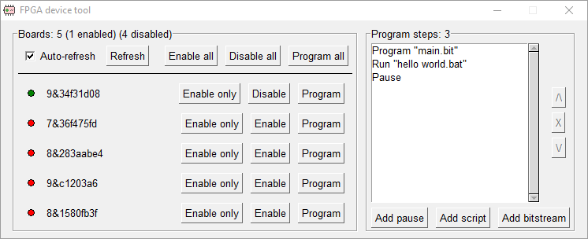

# FPGA device tool

Note: This tool was developed and published on the [SMACD 2023 conference](https://smacd-conference.org/). If you use this tool please cite the following paper:

`
A. Naya-Forcano, M. Garcia-Bosque, G. Díez-Señorans, S. Celma, "Multiprogram tools for FPGA boards with single identifier on Windows," International Conference on Synthesis, Modeling, Analysis and Simulation Methods, and Applications to Circuit Design (SMACD 2023), Madeira, Portugal, 2023.
`

## Description

This Windows project was developed to allow programming multiple PYNQ-Z2 FPGA boards while keeping them connected to the computer.
This particular board uses the same internal identifier, so tools like Vivado can't detect multiple boards connected to the same computer, and you can only program the first of them.
The project solves this issue by enabling/disabling the devices. By disabling all except one you can choose which board will be discoverable and available to program, while keeping all the others connected and powered.

The project started as [multiple single-file PowerShell scripts](https://gist.github.com/abeln94/153391e545934ed8cde2e796dd9bf7b5), but later was improved as a python application.

## Installation

You can download the [latest version](https://github.com/abeln94/fpga-device-tool/releases/latest) from the [releases page](https://github.com/abeln94/fpga-device-tool/releases).
Alternatively, you can download this project source code and run `pip install -r requirements.txt && python main.py`

## Usage

When the program launches it will ask for administrator permission (they are required to enable/disable the devices). Once granted, a dialog should be displayed that will show all connected and detected boards, and several buttons to perform various operations.

